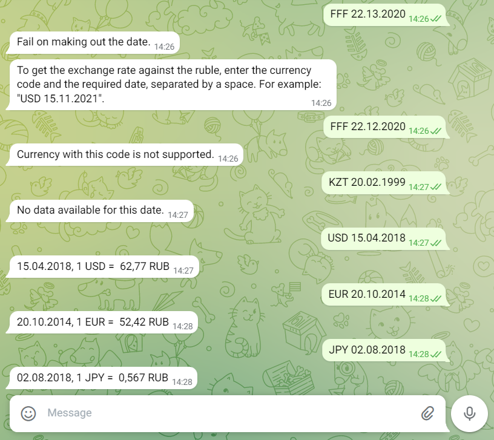

# @ExchangeRatesOnDate_Bot
Telegram bot, that allows to find out the currency exchange rate for the selected date. Base currency - russian ruble (RUR).

## Table of Contents
* [General Info](#general-information)
* [Technologies Used](#technologies-used)
* [Features](#features)
* [Screenshots](#screenshots)
* [Contact](#contact)

## General Information
- The application supports 120 foreign currencies.
- To get the exchange rate against the ruble, enter the currency code and the required date, separated by a space. For example: "USD 15.11.2021".
- https://currencyapi.com/api/v2/ is used as a currency conversion API.

## Technologies Used
- .NET - version 5.0
- Telegram.Bot library
- Using HttpClient and JSON parsing
- NLog
- Microsoft.Extensions.DependencyInjection
- xUnit
- Moq
- FluentAssertions

## Features
List the ready features here:
- Validation of messages from the user
- Formatting the exchange rate depending on it's value
- Global exception handling
- Different logging modes depending on build config

## Screenshots

## Contact
Created by [@Dmitriy Bulynko](https://linkedin.com/in/дмитрий-булынко-10bb53227) - feel free to contact me!
